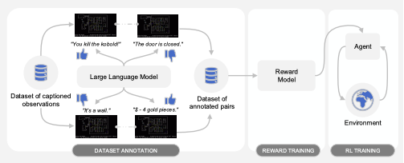

# Intrinsic Motivation Mechanisms in Artificial Agents: A Literature Review

## I. Introduction
### A. Background on Intrinsic Motivation

Intrinsic motivation refers to the spontaneous tendency "to seek out novelty and challenges, to extend and exercise one's capacity, to explore and to learn" [Richard Ryan et al](https://www.ncbi.nlm.nih.gov/pmc/articles/PMC5364176/#:~:text=Intrinsic%20motivation%20refers%20to%20the,70)

In Artificial Intellegence systems, intrinsic motivation is applied to agents so that agents can generate their own rewards based on their internal states and the perceived value of their actions. If the system is based on extrinsic motivation then the reward is provided by the external source. 

### B. Purpose of the Review

One of the recent publications titles "MOTIF: INTRINSIC MOTIVATION FROM ARTIFICIAL INTELLEGENCE FEEDBACK" [Martin Klissarov et al](https://arxiv.org/pdf/2310.00166) inspired this exploration. 

The authors had a challenging research question where they had to make an agent make decisions in an environment where the agnet had no prior knowledge. 
They proposed a general method for such problems which included grounding LLMs for decision making. "It elicits preferences from an LLM over pairs of captions to construct an intrinsic reward, which is then used to train agents with reinforcement learning". They then evaluated this proposed model's ie MOTIF's performance on the game NetHack with that of a procedural algorithm written to get the max score in the game. They then combined the environmental rewards to that of MOTIF's. This then outperformed the procedural algorithm.

## II. Theoretical Foundations of Intrinsic Motivation
### A. Psychological Theories
- Self-Determination Theory (Deci & Ryan)
- Flow Theory (Csikszentmihalyi)
- Optimal Arousal Theory

### B. Neuroscientific Insights
- Brain regions and neural circuits involved in curiosity and intrinsic motivation.
- Comparison with artificial neural networks.

## III. Intrinsic Motivation in Artificial Agents
### A. Definition and Scope
- Distinguishing intrinsic from extrinsic motivation.
- Applications in reinforcement learning and other AI domains.

### B. Types of Intrinsic Motivation Mechanisms
- Curiosity-driven exploration.
- Novelty and surprise detection.
- Information gain and uncertainty reduction.

## IV. Key Models and Algorithms
### A. Reinforcement Learning with Intrinsic Rewards
- Intrinsic reward functions and their design.
- Examples: Prediction error, empowerment, and novelty search.

### B. Evolutionary Algorithms
- Role of intrinsic motivation in evolutionary strategies.
- Case studies and applications.

### C. Hybrid Approaches
- Combining intrinsic and extrinsic motivations.
- Adaptive mechanisms and their benefits.

## V. Comparative Analysis
### A. Performance and Behavior
- Differences in learning efficiency and task performance.
- Behavioral patterns: exploration vs. exploitation.

### B. Robustness and Generalization
- Ability to handle diverse and dynamic environments.
- Transfer learning and adaptability.

## VI. Applications and Case Studies
### A. Robotics
- Autonomous exploration and navigation.
- Human-robot interaction.

### B. Game Playing
- Curiosity-driven agents in video games.
- Performance in complex, open-ended environments.

### C. Educational Technology
- Adaptive learning systems.
- Engagement and motivation in educational applications.

## VII. Challenges and Limitations
### A. Designing Effective Intrinsic Rewards
- Balancing complexity and simplicity.
- Avoiding pathological behaviors.

### B. Scalability and Computational Efficiency
- Resource requirements and optimization.
- Real-time implementation issues.

### C. Ethical Considerations
- Ensuring safety and ethical behavior in curiosity-driven agents.
- Implications for human-AI interaction.

## VIII. Future Directions
### A. Advanced Intrinsic Motivation Models
- Integration of multi-modal sensory inputs.
- Adaptive and context-aware mechanisms.

### B. Cross-Disciplinary Research
- Insights from psychology, neuroscience, and cognitive science.
- Collaborative efforts in developing sophisticated AI.

### C. Real-World Applications
- Expanding use cases in industry, healthcare, and education.
- Long-term impact and societal implications.

## IX. Conclusion
### A. Summary of Key Findings
- Recap of major insights from the literature.

### B. Implications for Future Research and Practice
- Potential for advancing AI and its applications.
- Call for continued exploration and innovation.

## X. References

- Deci, E. L., & Ryan, R. M. (1985). *Intrinsic Motivation and Self-Determination in Human Behavior*.
- Ryan, R. M., & Deci, E. L. (2000). Self-determination theory and the facilitation of intrinsic motivation, social development, and well-being. *American Psychologist*, 55(1), 68.
- Ryan, R. M., & Deci, E. L. (2017). *Self-Determination Theory: Basic Psychological Needs in Motivation, Development, and Wellness*.
- Satinder Singh, Richard L. Lewis, Andrew G. Barto. *Intrinsically Motivated Reinforcement Learning: An Evolutionary Perspective*
- Shaghayegh Roohi, Jari Takatalo, Christian Guckelsberger, Perttu Hämäläinen, *Review of Intrinsic Motivation in Simulation-based Game Testing*
